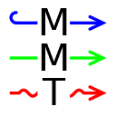

#  MMT Extension for Visual Studio Code

## Features

Syntax highlighting, typechecking, and building for the [MMT language](https://uniformal.github.io/).

<!-- code completion, typechecking, building, lenses. -->

<!-- screenshot or animation -->

## Usage

1. Create a directory for your MMT archives (e.g., called `archives`).
2. Clone MMT archives into that directory (e.g., by `git clone https://gl.mathhub.info/MMT/urtheories.git urtheories`).
3. Open your `archives` directory in Visual Studio Code

   On Windows, you can do this by navigating to your `archives` directory using WIndows Explorer, right-clicking in an empty space there, and selecting `Open with Code`.
   Alternatively and for other operating systems, open Visual Studio Code and select `File -> Open Folder...`.
4. In the Visual Studio Code window you can now open arbitrary `*.mmt` files.
5. When you have an `*.mmt` file opened, you can press Ctrl+Shift+P to open the command pallette and seek `typecheck` and `build`.

In case of errors or bugs, a helpful command is `Reload MMT`.

<!-- ## Extension Settings

This extension contributes the following settings:

* `myExtension.enable`: Enable/disable this extension.
* `myExtension.thing`: Set to `blah` to do something.
-->

## Known Issues

Currently no code completion or lenses.

## Sideloading

1. Download the [nightly build of this extension packaged as a `*.vsix` extension file](https://github.com/UniFormal/VSCode-MMT/releases/latest).
2. Open Visual Studio Code and press Ctrl+Shift+P (alternatively: `View -> Command Pallette...`)
3. In the Command Pallette type `VSIX` and select `>Extensions: Install from VSIX...`.
4. Select the `*.vsix` extension file you downloaded in step 1.

## Release Notes

## Unreleased

- Integrated MMT shell
- *Go To Definition* functionality is now more fine-grained only applicable on notations of a term (and not ambigiously on notations of its subterms)

## 0.2.0

- *Go To Definition* and *Find All References* support for MMT files
- no initial configuration necessary anymore: the extension comes now bundled with an `mmt.jar` and automatically infers Java Home from `java` on `PATH`

## 0.1.2

Minor updates of this README.

## 0.1.1

First version published to the Visual Studio Code marketplace.
